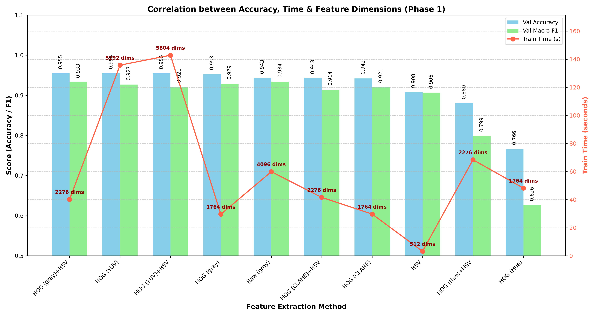
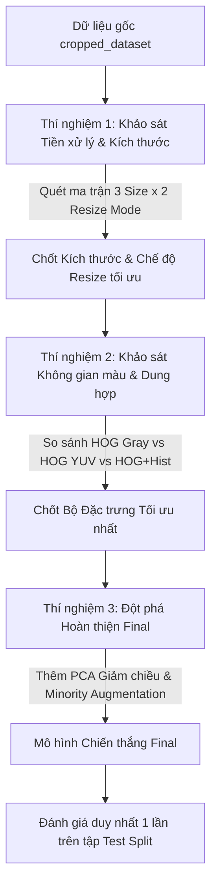

# LOG-03: Phân tích Chuyên sâu Trước Tinh chỉnh (Pre-Finetuning Analysis & Bottleneck Diagnosis)

- **Ngày ghi nhận:** 29/06/2026
- **Người thực hiện:** Nhóm nghiên cứu & AI Assistant
- **Trạng thái:** Đã phê duyệt (Approved & Locked)
- **Danh mục:** Phân tích Dữ liệu & Định hướng Thực nghiệm (Data Analysis & Experimental Roadmap)
- **Tham chiếu:** Kế thừa định hướng từ `LOG-01` (Research Scoping) và `LOG-02` (ML Model Locking)

---

## 1. TỔNG QUAN TÌNH HÌNH SAU PHASE 1 & 2 (EXECUTIVE SUMMARY)

Kết quả khảo sát ban đầu trên 14 cấu hình phương pháp trích xuất đặc trưng (tại `exphase_1.ipynb` và `exphase_2.ipynb`) với mô hình phân loại chuẩn (`StandardScaler + SVM RBF C=10`) đã xác định rõ ràng bảng xếp hạng Top 5 phương pháp tiềm năng nhất:

| Thứ hạng | Phương pháp Đặc trưng | Số chiều ($n\_features$) | Val Accuracy (%) | Val Macro F1 (%) | Thời gian Train (s) | Đánh giá sơ bộ |
| :---: | :--- | :---: | :---: | :---: | :---: | :--- |
| **1** | **Raw Pixels (Baseline)** | 4,096 | 94.30% | **93.40%** | 59.9s | Điểm cao nhưng số chiều nặng nề, nhiễu nền lớn |
| **2** | **HOG + Color Hist (gray)** | 2,276 | 95.51% | **93.27%** | 40.2s | **Tối ưu nhất:** Cân bằng hoàn hảo hình học & màu sắc |
| **3** | **HOG only (gray)** | 1,764 | 95.27% | **92.86%** | 29.6s | Nhanh, gọn nhưng thiếu thông tin nhận diện màu |
| **4** | **HOG only (yuv)** | 5,292 | 95.51% | **92.74%** | 135.8s | Số chiều gấp 3 lần HOG Gray nhưng F1 lại thấp hơn |
| **5** | **HOG + Color Hist (yuv)**| 5,804 | 95.51% | **92.09%** | 142.9s | Nặng nhất, bị ảnh hưởng nặng bởi Lời nguyền số chiều |

> *(Lưu ý: Các phương pháp thuộc Phase 2 như Edge Histogram 58.75%, Gabor 58.74%, LBP 30.74%, Hu Moments 25.11% đã chính thức bị loại bỏ theo `LOG-01`).*

---

## 2. CHẨN ĐOÁN CÁC ĐIỂM NGHẼN CỐT LÕI (BOTTLENECK DIAGNOSIS)

Trước khi bước vào tinh chỉnh chuyên sâu ở Phase 3, việc phân tích nguyên nhân gốc rễ (Root-cause Analysis) của các hiện tượng số liệu trên là bắt buộc để xây dựng giả thuyết nghiên cứu chính xác:

### 2.1. Nghịch lý Số chiều & Nhiễu kênh sắc độ (Curse of Dimensionality & Chroma Noise)
* **Hiện tượng:** Bộ đặc trưng kết hợp đầy đủ nhất là `HOG (YUV) + Color Hist` ($5,804\text{ chiều}$) có thời gian huấn luyện chậm gấp 3.5 lần so với `HOG (Gray) + Color Hist` ($2,276\text{ chiều}$), nhưng điểm F1 lại **tụt giảm $1.18\%$** ($92.09\%$ vs $93.27\%$).
* **Chẩn đoán nguyên nhân:** Kênh Y (Luma) trong không gian YUV phản ánh độ sáng, chứa đựng toàn bộ thông tin đường nét hình học tương tự ảnh Grayscale. Khi tính toán gradient HOG thêm trên 2 kênh màu sắc độ U và V, thay vì bổ sung thông tin cấu trúc, bộ lọc gradient lại thu nhận vô số vector nhiễu sinh ra từ hiện tượng phai màu sương mù, bóng râm hay cảm biến camera lóa sáng ngoài trời. Mô hình SVM phải gánh chịu **Lời nguyền số chiều**, các siêu phẳng bị nhiễu loạn bởi các chiều đặc trưng rác.

### 2.2. Điểm nghẽn Biến dạng Hình học do Tiền xử lý (Geometric Distortion Bottleneck)
* **Hiện tượng:** Trong Phase 1 & 2, tất cả bounding box biển báo giao thông được sử dụng hàm resize cưỡng bức ép thành hình vuông `64x64` (`stretch`).
* **Chẩn đoán nguyên nhân:** Biển báo Việt Nam theo tiêu chuẩn QCVN 41:2019 có nhiều hình dáng đa dạng như tam giác đều cảnh báo ($W.201 - W.247$) hoặc hình chữ nhật dài chỉ dẫn ($I.401 - I.449$). Việc bóp méo hình chữ nhật thành hình vuông làm vật thể bị "bè ra" hoặc "lùn đi", khiến các góc gradient HOG bị lệch hướng nghiêm trọng so với thực tế physical contours ($0^\circ - 180^\circ$).

### 2.3. Điểm mù Phân phối Đuôi dài (Long-tailed Class Imbalance Bottleneck)
* **Hiện tượng:** Dù mô hình SVM đã bật tham số `class_weight='balanced'`, điểm Macro F1 ($93.27\%$) vẫn luôn thấp hơn Accuracy ($95.51\%$).
* **Chẩn đoán nguyên nhân:** Dữ liệu NVTS có sự chênh lệch lớn: các lớp phổ biến có $>800$ ảnh, trong khi một số biển báo hiếm gặp chỉ có dưới $30$ ảnh train. `class_weight` chỉ điều chỉnh mức phạt lỗi trong hàm mục tiêu SVM, nhưng không thể bù đắp được việc thiếu hụt sự đa dạng góc chụp/ánh sáng của các lớp thiểu số. Do đó, Recall của các lớp thiểu số vẫn rất thấp.

---

## 3. THIẾT LẬP GIẢ THUYẾT NGHIÊN CỨU CHO PHASE 3 (RESEARCH HYPOTHESES)

Từ 3 chẩn đoán điểm nghẽn trên, nhóm nghiên cứu thiết lập 3 giả thuyết khoa học làm định hướng cho Phase 3:

* **Giả thuyết H1 (Về Tiền xử lý Dữ liệu):** Kỹ thuật tiền xử lý giữ nguyên tỷ lệ khung hình thực tế của biển báo bằng cách đệm viền đen (**Letterbox Padding / `pad_square`**) sẽ khắc phục triệt để biến dạng gradient HOG, mang lại điểm F1 vượt trội so với resize ép vuông (`stretch`), đặc biệt trên độ phân giải chuẩn `64x64`.
* **Giả thuyết H2 (Về Dung hợp Đặc trưng):** Sự dung hợp giữa đặc trưng đường nét trên kênh sáng cô đọng (`HOG Gray`) và thông tin màu sắc toàn cục (`Color Histogram HSV`) là tổ hợp tối ưu nhất cho biển báo Việt Nam. Tổ hợp này vừa giữ được sức mạnh phân biệt màu, vừa loại bỏ hoàn toàn nhiễu sắc độ U/V và Lời nguyền số chiều.
* **Giả thuyết H3 (Về Hoàn thiện Mô hình):** Việc áp dụng giảm chiều **PCA** (giữ 95% variance) kết hợp kỹ thuật tăng cường dữ liệu nhẹ cho riêng các nhóm thiểu số (**Minority Augmentation**) sẽ nén mô hình xuống dưới 500 chiều (tăng tốc inference gấp nhiều lần) đồng thời gia tăng đáng kể Recall cho các lớp hiếm.

---

## 4. LỘ TRÌNH THỰC THI 3 THÍ NGHIỆM TUẦN TỰ (STEPWISE EXPERIMENTAL ROADMAP)

Để kiểm chứng 3 giả thuyết trên trên hệ quy chiếu SVM cố định (`LOG-02`), Phase 3 được triển khai thành lộ trình 3 Thí nghiệm Chuyên đề Tuần tự:

### Chi tiết thiết lập Thí nghiệm:
1. **Thí nghiệm 1 (TN1 - Kiểm chứng H1): Khảo sát Tiền xử lý & Kích thước**
   * *Mô hình đặc trưng:* Cố định dùng `HOG Gray`.
   * *Ma trận khảo sát:* 3 Độ phân giải (`32x32`, `48x48`, `64x64`) $\times$ 2 Chế độ resize (`stretch`, `pad_square`). *(Tổng: 6 cấu hình)*.
   * *Đầu ra:* Chọn ra cấu hình Tiền xử lý cho F1 cao nhất trên tập Validation.
2. **Thí nghiệm 2 (TN2 - Kiểm chứng H2): Khảo sát Không gian màu & Dung hợp**
   * *Tiền xử lý:* Khóa cố định theo kết quả chiến thắng tại TN1.
   * *Ma trận khảo sát:* So sánh 3 bộ ứng cử viên Top đầu: `HOG Gray`, `HOG YUV`, `HOG Gray + Color Hist (HSV)`. *(Tổng: 3 cấu hình)*.
   * *Đầu ra:* Chứng minh sự vượt trội của dung hợp đa thức và chốt Bộ đặc trưng tối ưu.
3. **Thí nghiệm 3 (TN3 - Kiểm chứng H3): Đột phá Hoàn thiện Mô hình Final**
   * *Đặc trưng:* Khóa cố định theo kết quả chiến thắng tại TN2.
   * *Thực nghiệm hoàn thiện:* 
     * Tích hợp `PCA` giảm chiều trước SVC để tối ưu tốc độ.
     * Áp dụng `minority_light augmentation` để cân bằng tập Train.
   * *Đầu ra:* Chọn ra Mô hình Final hoàn hảo nhất để tiến hành đánh giá chính thức trên tập `Test Split`.
