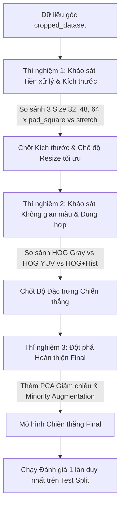

# LOG-04: Tài liệu Tổng hợp Bối cảnh & Định hướng Dự án cho Thành viên Nhóm (Project Executive Summary & Team Onboarding Context)

- **Ngày ban hành:** 29/06/2026
- **Đối tượng sử dụng:** Tất cả thành viên nhóm nghiên cứu (Đặc biệt dành cho thành viên bắt đầu tham gia giai đoạn thực nghiệm)
- **Mục đích:** Cung cấp bức tranh toàn cảnh (Context), tiến độ lịch sử (History) và các định hướng chiến lược (Strategic Roadmap) đã được chốt để toàn bộ nhóm thống nhất tư duy khoa học trước khi bước vào thực thi.

---

## LỜI NÓI ĐẦU: CHÀO MỪNG ĐẾN VỚI DỰ ÁN! 🚀

Dự án của chúng ta tập trung giải quyết bài toán **Phân loại Biển báo Giao thông Việt Nam (Vietnam Traffic Sign Recognition)** trên bộ dữ liệu chuẩn hóa **NVTS**. Đây là một bài toán thách thức trong lĩnh vực Thị giác máy tính cổ điển (Classical Computer Vision), đòi hỏi chúng ta phải tìm ra sự kết hợp tối ưu nhất giữa các phương pháp Trích xuất đặc trưng truyền thống (Hand-crafted Features) và Mô hình Học máy (Machine Learning Classifier) để đạt độ chính xác cao nhất với chi phí tính toán tối ưu.

Tài liệu này được soạn thảo để giúp bạn nắm bắt ngay lập tức **chúng ta đang ở đâu**, **tại sao chúng ta lại chọn hướng đi hiện tại**, và **bức tranh tổng thể tiếp theo là gì** mà không cần phải đọc lại hàng ngàn dòng code hay log cũ.

---

## PHẦN 1: BẢN ĐỒ DỮ LIỆU GỐC (DATASET CONTEXT)

Dữ liệu dự án được lưu trữ tại `cropped_dataset` và chia sẵn chuẩn mực thành 3 tập độc lập:
* **`train` (6,605 ảnh):** Dùng để huấn luyện mô hình học máy. Tensor shape chuẩn hóa ban đầu là `(6605, 64, 64, 3)`.
* **`val` (824 ảnh):** Dùng làm tập thẩm định (Validation). **Toàn bộ quá trình đánh giá, sàng lọc đặc trưng và chọn cấu hình tối ưu đều được quyết định dựa trên số liệu của tập này.**
* **`test` (851 ảnh):** Dùng làm tập kiểm thử tuyệt đối. **Tập này được khóa kín và chỉ chạy đánh giá đúng 1 lần duy nhất ở bước cuối cùng của dự án** để lấy số liệu báo cáo luận văn/bài báo khoa học.

---

## PHẦN 2: LỊCH SỬ THỰC NGHIỆM GIAI ĐOẠN 1 & 2 (PRELIMINARY BENCHMARKING)

Trước phiên làm việc hôm nay, dự án đã hoàn thành khảo sát sàng lọc diện rộng 14 cấu hình trích xuất đặc trưng (tại `exphase_1.ipynb` và `exphase_2.ipynb`) trên bộ phân loại mặc định `StandardScaler + SVC(kernel='rbf', C=10.0)`.

Kết quả thu được (lưu tại `log/exphase_2_result/feature_svm_phase1_phase2_validation_comparison.csv`) đã phân chia các phương pháp thành 2 nhóm rõ rệt:

### 1. Nhóm Chiến thắng (Top 5 ứng cử viên Phase 1):
1. **Raw Pixels (Baseline):** F1 = `93.40%` (Vector $4,096\text{ chiều}$). Điểm cao nhưng nặng nề, nhiều nhiễu nền.
2. **HOG + Color Histogram (gray):** F1 = `93.27%` (Vector $2,276\text{ chiều}$). **Cân bằng tối ưu nhất giữa hình học và màu sắc.**
3. **HOG only (gray):** F1 = `92.86%` (Vector $1,764\text{ chiều}$). Nhanh gọn nhất nhưng thiếu thông tin màu.
4. **HOG only (yuv):** F1 = `92.74%` (Vector $5,292\text{ chiều}$).
5. **HOG + Color Histogram (yuv):** F1 = `92.09%` (Vector $5,804\text{ chiều}$).

### 2. Nhóm Thất bại (Các phương pháp Phase 2):
* **Edge Histogram:** F1 = `58.75%`
* **Gabor Filters:** F1 = `58.74%`
* **Local Binary Patterns (LBP):** F1 = `30.74%`
* **Hu Moments:** F1 = `25.11%`

---

## PHẦN 3: 3 QUYẾT ĐỊNH CHIẾN LƯỢC VƯỢT BẬC (CORE STRATEGIC DECISIONS)

Trong phiên làm việc hiện tại, nhằm giải quyết nguy cơ "nghiên cứu dàn trải bề mặt" (tham rộng thiếu sâu) và tránh bùng nổ không gian tổ hợp (hơn 36,000 cấu hình), nhóm đã thống nhất thông qua 3 văn bản kiến trúc cốt lõi (luu tại `vault/log/`):

### 📌 Quyết định 1 (LOG-01): Thu hẹp Phạm vi Nghiên cứu (Research Scoping)
* **Chốt loại bỏ hoàn toàn Phase 2:** Các phương pháp LBP, Gabor, Hu Moments, Edge Hist chính thức dừng lại ở giai đoạn khảo sát. Trong báo cáo, chúng ta chỉ dùng 1 bảng số liệu tóm tắt để chứng minh sự kém hiệu quả của chúng trước biển báo Việt Nam.
* **Tập trung 100% nguồn lực vào HOG & Color Histogram:** Nghiên cứu chuyển hướng thành "Đào sâu bản chất đường nét HOG và sự kết hợp không gian màu trên biển báo Việt Nam".

### 📌 Quyết định 2 (LOG-02): Khóa Cố định Mô hình Học máy (ML Model Locking)
* Chúng ta **KHÔNG** dàn trải thử nghiệm Random Forest, XGBoost, KNN hay Neural Networks vì lý luận toán học chứng minh chúng bị phân mảnh ranh giới hoặc overfit nghiêm trọng trong không gian nghìn chiều nhưng ít mẫu (HDLSS).
* Chúng ta **KHÔNG** chạy Grid Search tham số SVM phức tạp ở Phase 3.
* **Toàn bộ pipeline phân loại được khóa cố định ở tiêu chuẩn vàng:**
  $$\mathbf{StandardScaler()} \longrightarrow \mathbf{SVC}\big(\text{kernel='rbf'}, C=10.0, \gamma=\text{'scale'}, \text{class\_weight='balanced'}\big)$$
* *Ý nghĩa:* Hệ quy chiếu cố định này đảm bảo mọi cải tiến F1 tiếp theo đều là minh chứng khoa học tinh khôi 100% của việc tối ưu hóa Tiền xử lý ảnh và Đặc trưng.

### 📌 Quyết định 3 (LOG-03): Chẩn đoán Điểm nghẽn & Tái cấu trúc Phase 3
Nhóm đã phát hiện ra 3 điểm nghẽn kìm hãm hiệu năng hiện tại và xây dựng giải pháp tương ứng:
1. **Điểm nghẽn 1 (Nhiễu sắc độ YUV):** HOG YUV + Hist nặng gấp 3.5 lần HOG Gray + Hist nhưng điểm lại tụt ($92.09\%$ vs $93.27\%$). Lý do: Kênh màu U/V chứa nhiều nhiễu chói nắng/phai màu ngoài trời gây ra Lời nguyền số chiều.
2. **Điểm nghẽn 2 (Biến dạng hình học):** Resize ép vuông (`stretch`) làm bóp méo biển báo tam giác/chữ nhật dài, làm sai lệch góc gradient HOG $0^\circ-180^\circ$.
3. **Điểm nghẽn 3 (Mất cân bằng đuôi dài):** Các lớp biển báo thiểu số (<30 ảnh) có Recall thấp dù đã dùng trọng số `balanced`.

---

## PHẦN 4: LỘ TRÌNH THÍ NGHIỆM TUẦN TỰ SẮP TỚI (PHASE 3 ROADMAP)

Thay vì chạy 120 mẫu ngẫu nhiên gộp chung mù quáng như thiết kế cũ của Phase 3, chúng ta sẽ thực hiện lộ trình **3 Thí nghiệm Chuyên đề Tuần tự (Stepwise Thematic Experiments)**. Các thành viên khi nhận nhiệm vụ sẽ thực hiện theo chuỗi kế thừa này:

### Bản chất khoa học của 3 Thí nghiệm:
* **Thí nghiệm 1 (TN1 - Giả thuyết H1):** Chứng minh kỹ thuật đệm viền đen giữ tỷ lệ hình học (`pad_square`) giúp vector HOG chuẩn xác hơn ép vuông (`stretch`). *(6 lần chạy)*.
* **Thí nghiệm 2 (TN2 - Giả thuyết H2):** Trên ảnh chốt từ TN1, chứng minh sự dung hợp `HOG Gray + Color Hist (HSV)` đánh bại `HOG YUV` do triệt tiêu được nhiễu sắc độ. *(3 lần chạy)*.
* **Thí nghiệm 3 (TN3 - Giả thuyết H3):** Trên đặc trưng chốt từ TN2, áp dụng `PCA` (giữ 95% variance) để giảm chiều mô hình xuống dưới 500 dims, đồng thời áp dụng **Tăng cường dữ liệu trên ảnh (`minority_light augmentation`)** cho các lớp hiếm. *(2-3 lần chạy)*.

> ⚠️ **LƯU Ý KỸ THUẬT QUAN TRỌNG:** Ở TN3, chúng ta tuyệt đối **KHÔNG dùng kỹ thuật SMOTE** để cân bằng dữ liệu. Lý do: SMOTE nội suy tuyến tính trong không gian nghìn chiều sẽ tạo ra các vector HOG lai tạp phá vỡ hoàn toàn cấu trúc vật lý thực tế của biển báo. Ta chỉ áp dụng Augmentation xoay/lật nhẹ trực tiếp trên ảnh gốc 2D trước khi rút HOG.

---

## PHẦN 5: CẤU TRÚC TÀI LIỆU CẦN NẮM TRONG VAULT
Để tìm hiểu sâu hơn về lý luận toán học và công thức, các thành viên có thể đọc trực tiếp 3 file log tiền nhiệm trong thư mục `vault/log/`:
1. [01_26-06-29_research_scoping_decision.md](file:///home/dacekey/AIL303_SUM26/paper/vault/log/01_26-06-29_research_scoping_decision.md): Quyết định thu hẹp phạm vi và chuyển sang 3 thí nghiệm tuần tự.
2. [02_26-06-29_ml_model_selection_and_locking.md](file:///home/dacekey/AIL303_SUM26/paper/vault/log/02_26-06-29_ml_model_selection_and_locking.md): Cơ sở toán học vượt trội của SVM và lý do loại trừ Tree, KNN, MLP, Logistic Regression.
3. [03_26-06-29_pre_finetuning_analysis.md](file:///home/dacekey/AIL303_SUM26/paper/vault/log/03_26-06-29_pre_finetuning_analysis.md): Phân tích điểm nghẽn và thiết lập giả thuyết H1, H2, H3.

**Chúc toàn bộ nhóm hợp tác ăn ý và thành công rực rỡ trong các thực nghiệm sắp tới!** 🔥
