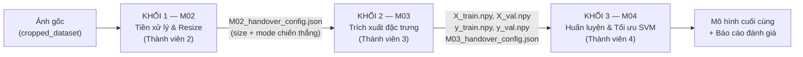
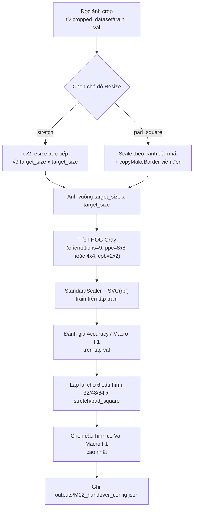
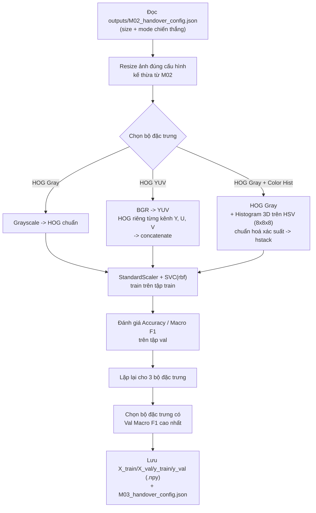
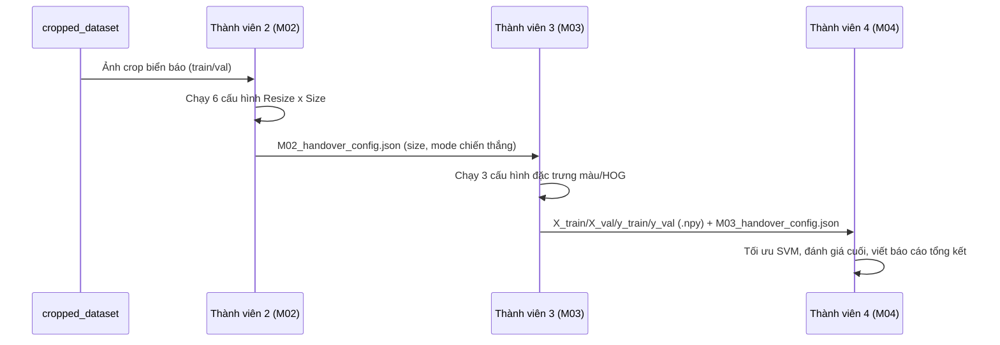

# PIPELINE DỰ ÁN: Nhận diện Biển báo Giao thông Việt Nam
### (Phương pháp Machine Learning cổ điển — KHÔNG sử dụng Deep Learning)

- **Ngày trình bày:** 01/07/2026
- **Phạm vi tài liệu:** Toàn bộ pipeline xử lý dữ liệu → trích xuất đặc trưng → huấn luyện/đánh giá, tương ứng với 2 nhiệm vụ đã hoàn thành: `M02` (Thành viên 2) và `M03` (Thành viên 3).
- **Tài liệu tham chiếu:** `LOG-02` (khóa tham số bộ phân loại), `LOG-03` (giả thuyết H1, H2).

---

## 1. TỔNG QUAN KIẾN TRÚC PIPELINE

Toàn bộ hệ thống là một pipeline **học máy cổ điển (classical ML)**, không dùng mạng nơ-ron / deep learning. Dữ liệu đi qua 4 khối xử lý tuần tự, mỗi khối do một thành viên phụ trách và bàn giao kết quả bằng file cấu hình/artifact cụ thể cho thành viên kế tiếp:

**Nguyên tắc xuyên suốt toàn pipeline:**
- Mỗi giai đoạn chỉ được thay đổi **đúng một biến thí nghiệm** (resize ở M02, đặc trưng màu/HOG ở M03), các phần còn lại khóa cứng theo `LOG-02` để đảm bảo so sánh công bằng (fair comparison).
- Bộ phân loại dùng xuyên suốt cả 2 khối: `StandardScaler()` + `SVC(kernel='rbf', C=10.0, gamma='scale', class_weight='balanced')`.
- Không có bước nào dùng CNN/mạng nơ-ron — toàn bộ đặc trưng là **thủ công (hand-crafted)**: HOG (Histogram of Oriented Gradients) và Color Histogram.
- Bàn giao giữa các khối luôn thông qua **file cấu hình JSON + mảng đặc trưng `.npy`**, không truyền miệng/thủ công, để tái lập được (reproducible).

---

## 2. KHỐI 1 — M02: TIỀN XỬ LÝ & KÍCH THƯỚC ẢNH

**Người phụ trách:** Thành viên 2 · **Giả thuyết kiểm chứng:** H1 (`pad_square` vượt trội `stretch`?)

### 2.1 Sơ đồ luồng xử lý trong khối

### 2.2 Ma trận thí nghiệm

| Trục biến đổi | Giá trị khảo sát |
| :--- | :--- |
| Kích thước ảnh (`target_size`) | `32`, `48`, `64` |
| Chế độ Resize | `stretch`, `pad_square` |
| Đặc trưng (khóa cứng) | `HOG Gray` — `orientations=9`, `pixels_per_cell=(8,8)` *(riêng size 32 dùng `(4,4)`)*, `cells_per_block=(2,2)` |
| Bộ phân loại (khóa cứng) | `StandardScaler()` + `SVC(kernel='rbf', C=10.0, gamma='scale', class_weight='balanced')` |

→ Tổng cộng **6 lần chạy** (2 mode × 3 size), đo `Val Accuracy`, `Val Macro F1`, `Thời gian Train`.

### 2.3 Artifact đầu ra (Handover sang M03)

| File | Nội dung |
| :--- | :--- |
| `outputs/M02_results_6_configs.csv` | Bảng số liệu đầy đủ 6 cấu hình |
| `outputs/M02_handover_config.json` | `winner_size`, `winner_mode`, `winner_pixels_per_cell`, đường dẫn dataset, danh sách lớp |

**Nguyên tắc bàn giao:** M03 phải **đọc lại file này**, tuyệt đối không tự ý chọn size/mode khác — đảm bảo tính nhất quán khoa học giữa 2 thí nghiệm.

---

## 3. KHỐI 2 — M03: KHÔNG GIAN MÀU & DUNG HỢP ĐẶC TRƯNG

**Người phụ trách:** Thành viên 3 · **Giả thuyết kiểm chứng:** H2 (`HOG Gray + Color Hist HSV` vượt trội `HOG YUV`?)

### 3.1 Sơ đồ luồng xử lý trong khối

### 3.2 Ma trận thí nghiệm

| Mã TN | Bộ đặc trưng | Mô tả kỹ thuật |
| :---: | :--- | :--- |
| TN2.1 | `HOG Gray` | Baseline — nhanh, gọn, chỉ có hình học, thiếu thông tin màu |
| TN2.2 | `HOG YUV` | HOG trên cả 3 kênh Y/U/V nối lại — số chiều gấp ~3 lần, kiểm chứng nhiễu U/V |
| TN2.3 | `HOG Gray + Color Hist (HSV)` | Dung hợp đa thức (feature fusion): hình học (HOG) + màu sắc (Histogram) |

Bộ phân loại vẫn khóa cứng như M02 (`StandardScaler + SVC rbf C=10.0`), size/mode ảnh kế thừa nguyên vẹn từ M02.

### 3.3 Artifact đầu ra (Handover sang M04)

| File | Nội dung |
| :--- | :--- |
| `outputs/M03_results_3_configs.csv` | Bảng số liệu 3 bộ đặc trưng |
| `outputs/M03_X_train.npy`, `M03_y_train.npy` | Ma trận đặc trưng + nhãn tập train (bộ đặc trưng thắng) |
| `outputs/M03_X_val.npy`, `M03_y_val.npy` | Ma trận đặc trưng + nhãn tập val (bộ đặc trưng thắng) |
| `outputs/M03_handover_config.json` | Tên bộ đặc trưng thắng, số chiều gốc, tham số HOG đã dùng |

**Ý nghĩa artifact:** Thành viên 4 **không cần trích xuất lại đặc trưng** — chỉ nạp trực tiếp các file `.npy` để tập trung vào bước tối ưu mô hình cuối cùng (tinh chỉnh siêu tham số, thử nghiệm mô hình cổ điển khác...).

---

## 4. BẢNG TỔNG HỢP CÔNG NGHỆ SỬ DỤNG (Không Deep Learning)

| Thành phần | Công cụ / Kỹ thuật |
| :--- | :--- |
| Đọc & xử lý ảnh | `OpenCV (cv2)` |
| Tiền xử lý hình học | `cv2.resize`, `cv2.copyMakeBorder` |
| Đặc trưng hình học | `HOG` (Histogram of Oriented Gradients) — `scikit-image` |
| Đặc trưng màu sắc | `Color Histogram 3D` trên không gian `HSV` — `cv2.calcHist` |
| Chuẩn hoá dữ liệu | `StandardScaler` — `scikit-learn` |
| Mô hình phân loại | `SVC` (Support Vector Classifier, kernel RBF) — `scikit-learn` |
| Đánh giá | `Accuracy`, `Macro F1-score` — `scikit-learn.metrics` |
| Bàn giao giữa các khối | `JSON` (cấu hình) + `NumPy .npy` (ma trận đặc trưng) |

---

## 5. TÓM TẮT LUỒNG BÀN GIAO GIỮA CÁC THÀNH VIÊN

---

## 6. GHI CHÚ CHO BÁO CÁO NỘP

- Toàn bộ số liệu Accuracy/F1/thời gian train trình bày trong báo cáo phải lấy từ **kết quả thực đo** khi chạy 2 notebook `M02_experiment_1_preprocessing_and_size.ipynb` và `M03_experiment_2_colorspace_and_fusion.ipynb` trên máy, không dùng số liệu minh hoạ trong tài liệu nhiệm vụ gốc.
- Mỗi khối đều tuân thủ nguyên tắc **một biến thay đổi tại một thời điểm** (single-variable experiment), giữ nguyên các thành phần khác để đảm bảo so sánh khoa học hợp lệ.
- Pipeline được thiết kế để **tái lập được (reproducible)**: chỉ cần chạy lại 2 notebook theo đúng thứ tự M02 → M03 là tái tạo toàn bộ artifact bàn giao.
